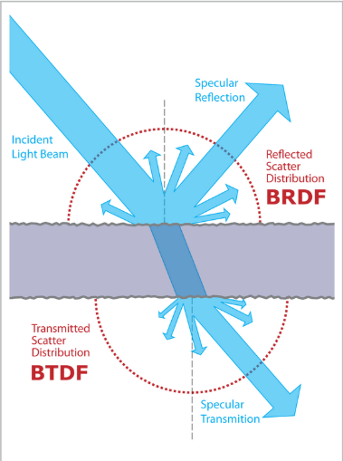

# PBR Details

현대 PBR은 MicroFacet 이론에 근거한다.

MicroFacet 이론은 실제 물체의 표면을 "아주 작고 많은 Perfect Mirror들의 집합"으로 보고 빛을 시뮬레이션하는 물리 모델이다.

이 미세 거울들이 얼마나 난잡하게 분포하는지를 $\text{Roughness}$ 값으로 표현하고,

표면의 금속성을 $\text{Metalness}$ 값으로 표현한다.

## BSDF

BSDF(Bidirectional scattering distribution function) 는 양방향 산란 분포함수로, 특정 표면에서 입사한 빛이 다른 방향으로 반사/굴절될 때의 세기 분포를 나타낸다.

반사되는 빛들을 다루는 BRDF(Bidirectional reflectance distribution function), 

투과되는 빛들을 다루는 BTDF(Bidirectional transmittance distribution function)

를 모두 고려하는 상위 개념이다.



실제로는 빛은 반사되거나 투과되거나 둘 중 하나의 상태만 가질 수 있다. 

따라서 코드에서는 입사방향과 반사방향이 표면에 대해 같은 영역에 있는지, 조건

$$ (N \cdot L) \times (N \cdot V) > 0 $$

을 검사해 BRDF를 사용할지 BTDF를 사용할지 결정한다.

```

fn BSDF(X, L, V) -> vec3<f32>
{
    let T : f32         = GetTransmittance(X);
    let N : vec3<f32>   = GetSurfaceNormal(X);

    if (dot(L, N) * dot(V, N) > 0.0) { return (1.0 - T) * BRDF(X, L, V); }
    return T * BTDF(X, L, V);
}

```

---

### BRDF

BRDF는 빛의 반사를 정반사/난반사로 나누어 각 반사의 산술합으로 표현한다.

$$ \text{BRDF}(\mathbf{x}, L, V) = k_df_{diffuse} + f_{specular} $$

여기서 $f_{diffuse}$ 는 이상적인 난반사 (Lambertian Diffuse)를 채택한다.

$$ f_{diffuse} = \frac{\text{Albedo}}{\pi}$$

가장 표준적으로 사용되는 Specular BRDF 모델은 Cook-Torrance 모델로, 이 모델에서 $f_{specular}$ 는

$$ f_{Cook-Torrance} = \frac{F(L,H) \times G(N,V,L) \times D(N,H)}{4 (N \cdot V) (N \cdot L)} $$
$$ H = \text{normalize}(L + V) $$

로 계산되는 값을 사용한다.

마지막으로 $k_d$ 는 빛이 난반사로 얼마나 빠졌는지를 나타내는 계수로써,

$$k_d = (1 - F)(1 - \text{Metalness})$$

의 값으로 계산한다. 이는 금속 재질의 경우 정반사만이 존재하며, 나머지 빛은 내부로 흡수된다는 물리적 현상을 반영하기 때문이다.

---

### BTDF

BTDF는 Walter의 모델을 사용한다. 투과성 재질의 경우 BTDF가 사용되며, 자세한 공식은 아래와 같다.

$$ \text{BTDF}(L, V) = |L \cdot H| \times |V \cdot H| \times \frac{\eta_o^2 \times (1 - F(L,H))}{(\eta_i(L \cdot H) + \eta_o(V \cdot H))^2} \times \frac{G(N,V,L)}{|N \cdot V| |N \cdot L|} \times D(N,H) $$

$$ H = \text{normalize}(\eta_iL + \eta_oV) $$

$\eta_i, \eta_o$ 는 각각 표면으로 입사, 투과하는 매질의 굴절률이다.

---

### PBR Functions

위의 BRDF, BTDF를 계산할 때 언급된 여러 함수들을 살펴보자.

$\text{D}$ 는 Distribution Function 으로, 가장 널리 쓰이는 GGX-Distribution 을 사용한다.

$$ D(N, H) = \frac{\text{Roughness}^4}{\pi[(N \cdot H)^2 (\text{Roughness}^4 - 1) + 1]^2} $$

$\text{G}$ 는 Geometry Shadow Function 으로, 실시간 렌더링에서 표준으로 사용되는 Smith-Schlick 근사식을 채택한다.

$$ G(N,V,L) = \frac{(N \cdot L)}{(N \cdot L)(1 - k) + k} \times \frac{(N \cdot V)}{(N \cdot V)(1 - k) + k} $$
$$ k = \frac{(\text{Roughness} + 1)^2}{8} $$

$\text{F}$ 는 Frensel Function 이다.

$$ F(L, H) = F_0 + (1 - F_0) \times [1 - \text{saturate}(L \cdot H)]^5 $$

$$ F_0 = \text{lerp}((\frac{1 - \eta}{1 + \eta})^2, \text{Albedo}, \text{Metalness}) $$

## Lights

Rendering Equation 에서, 씬의 모든 광원에 대해 적분

$$
\int_{\mathrm{Light}} 
f_s(\mathbf{x}, {\hat{\omega}}_i, {\hat{\omega}}_o) 
L_{\mathrm{emit}}(\mathbf{x}', -{\hat{\omega}}_i) 
V(\mathbf{x}' \leftrightarrow \mathbf{x}) 
(\hat{\mathbf{n}} \cdot {\hat{\omega}}_i) 
d\omega_i
$$

을 결정할 필요가 있었다. 

일부 광원들은 광원의 기하 정보가 명시적으로 주어진다. 이 경우에 한해서는, 적분 변수를 Solid Angle 에서 Area로 가져가는 게 편하다. 이 때 적분은

$$
\int_{\mathrm{Light}} 
f_s(\mathbf{x}, {\hat{\omega}}_i, {\hat{\omega}}_o) 
L_{\mathrm{emit}}(\mathbf{x}', -{\hat{\omega}}_i) 
V(\mathbf{x}' \leftrightarrow \mathbf{x}) 
G(\mathbf{x}' \leftrightarrow \mathbf{x}) 
dA
$$

의 면적분으로 바뀐다. 새로운 함수 G는 변수변환의 Jacobian과 $(\hat{\mathbf{n}} \cdot {\hat{\omega}}_i)$ 항을 모두 포함한 기하 함수이다.

$$ G(\mathbf{x}' \leftrightarrow \mathbf{x}) = \frac{|\hat{\mathbf{n}} \cdot {\hat{\omega}}_i||\hat{\mathbf{n}}' \cdot {\hat{\omega}}_i|}{|\mathbf{x}' - \mathbf{x}|^2} $$

프로젝트에 사용한 광원은 총 3개, Directional Light, Point Light, Area Light 이다.

이들 광원이 어떤 $L_{\mathrm{emit}}(\mathbf{x}, \hat{\omega})$ 를 갖는지 살펴보자.

---

### Directional Light

방향만이 유효한 광원이다. 빛의 방향을 $\hat{\omega}_L$ 이라 하면

$$ L_{\mathrm{emit}}(\mathbf{x}, \hat{\omega}) = L_0 \times \delta(\hat{\omega} - \hat{\omega}_L) $$

이다.

렌더링 방정식의 Directional Light 에 대한 적분은

$$
\int_{\mathrm{Light}} 
f_s(\mathbf{x}, {\hat{\omega}}_i, {\hat{\omega}}_o) 
L_0\delta(-\hat{\omega}_i -\hat{\omega}_L) 
V(\mathbf{x}' \leftrightarrow \mathbf{x}) 
(\hat{\mathbf{n}} \cdot {\hat{\omega}}_i) 
d\omega_i =
f_s(\mathbf{x}, -\hat{\omega}_L, {\hat{\omega}}_o) 
L_0
V(\mathbf{x}' \leftrightarrow \mathbf{x}) 
(\hat{\mathbf{n}} \cdot -\hat{\omega}_L) 
$$

의 해석적인 값으로 주어지겠다.

---

### Point Light

위치만이 유효한 광원이다. 이 광원은 모든 방향으로 동일한 세기의 빛을 방출하므로

$$ L_{\mathrm{emit}}(\mathbf{x}, \hat{\omega}) = L_0 $$

이다.

$$
\int_{\mathrm{Light}} 
f_s(\mathbf{x}, {\hat{\omega}}_i, {\hat{\omega}}_o) 
L_{\mathrm{emit}}(\mathbf{x}', -{\hat{\omega}}_i) 
V(\mathbf{x}' \leftrightarrow \mathbf{x}) 
G(\mathbf{x}' \leftrightarrow \mathbf{x}) 
dA
$$

의 면적분은, 넓이가 없는 Point Light 에 대해서는 한 지점에서의 Evaluation으로 바뀐다.

즉

$$
f_s(\mathbf{x}, {\hat{\omega}}_L, {\hat{\omega}}_o) 
L_0
V(\mathbf{x}_L \leftrightarrow \mathbf{x}) 
G(\mathbf{x}_L \leftrightarrow \mathbf{x}) 
$$

이 되겠다.

---

### Area Light

Area Light는 수많은 Point Light들의 집합으로 보고 계산한다.

영역의 한 점을 Sampling (Uniform Distribution 추천)한 후, Point Light의 빛을 계산한 후 PDF 값으로 나누면 된다.

$$
\frac
{
f_s(\mathbf{x}, {\hat{\omega}}_L, {\hat{\omega}}_o) 
L_0
V(\mathbf{x}_L \leftrightarrow \mathbf{x}) 
G(\mathbf{x}_L \leftrightarrow \mathbf{x}) 
}
{
\text{PDF}(\mathbf{x}_L)
}
$$

Uniform Distribution 기준, $\text{PDF}(\mathbf{x}_L) = \frac{1}{\text{Area}}$ 이므로 Area Light 에 대한 적분은

$$
f_s(\mathbf{x}, {\hat{\omega}}_L, {\hat{\omega}}_o) 
L_0
V(\mathbf{x}_L \leftrightarrow \mathbf{x}) 
G(\mathbf{x}_L \leftrightarrow \mathbf{x})
\times \text{Area}
$$

로 나타난다.

## Indirect Path Sampling

Monte-Carlo Estimator 의 추정치를 줄이기 위해서, 현재 표면의 재질에 따라 별도의 샘플링 전략을 사용한다.

난반사는 Cosine-Weighted Hemisphere 에서 샘플링하며,

```
fn SampleCosineHemisphere() -> vec3<f32>
{
    let Random_1 : f32 = Random();
    let Random_2 : f32 = Random();

    let R       : f32 = sqrt(Random_1);
    let Phi     : f32 = 2.0 * PI * Random_2;

    let X   : f32 = R * cos(Phi);
    let Y   : f32 = R * sin(Phi);
    let Z   : f32 = sqrt(1.0 - Random_1);

    return vec3<f32>(X, Y, Z);
}
```

그 외의 경우들(정반사, 굴절)은 GGX-Distribution 으로부터 샘플링해 $H$ 벡터를 구한다.

```
fn SampleGGX(Roughness: f32) -> vec3<f32>
{
    let Random_1 : f32 = Random();
    let Random_2 : f32 = Random();

    let Alpha   : f32 = Roughness * Roughness;
    let Phi     : f32 = 2.0 * PI * Random_1;

    let CosTheta : f32 = sqrt((1.0 - Random_2) / (1.0 + (Alpha * Alpha - 1.0) * Random_2));
    let SinTheta : f32 = sqrt(1.0 - CosTheta * CosTheta);

    let H_X : f32 = SinTheta * cos(Phi);
    let H_Y : f32 = SinTheta * sin(Phi);
    let H_Z : f32 = CosTheta;

    return normalize(vec3<f32>(H_X, H_Y, H_Z));
}
```